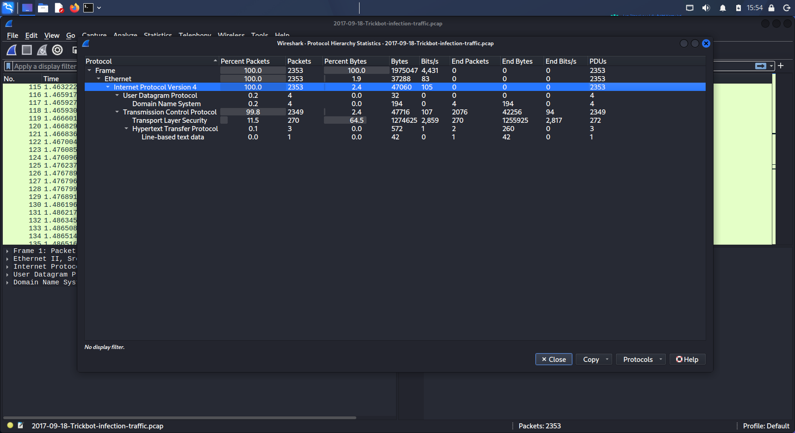
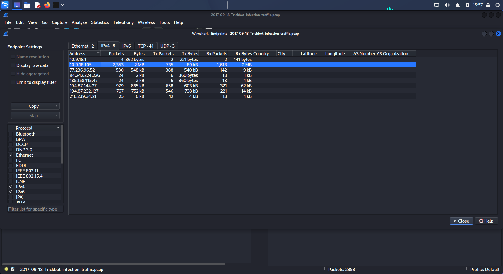
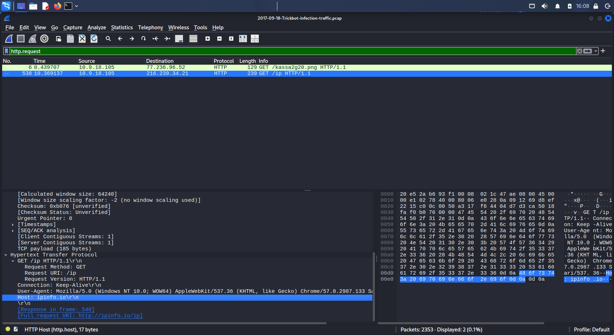
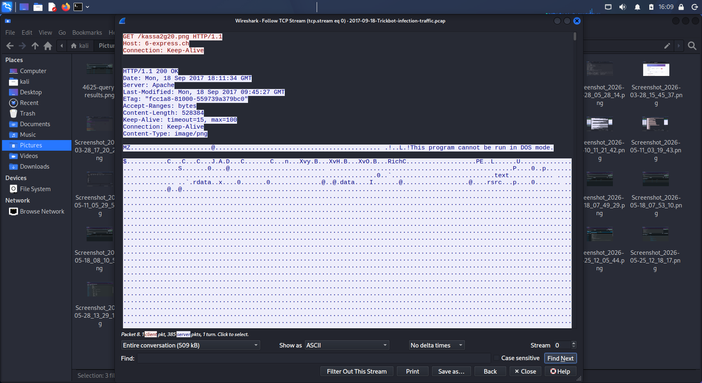
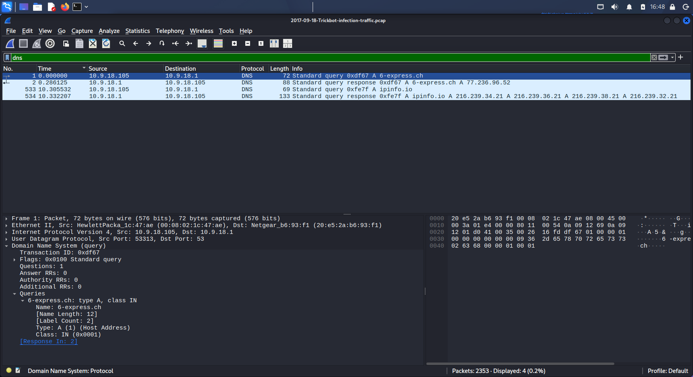
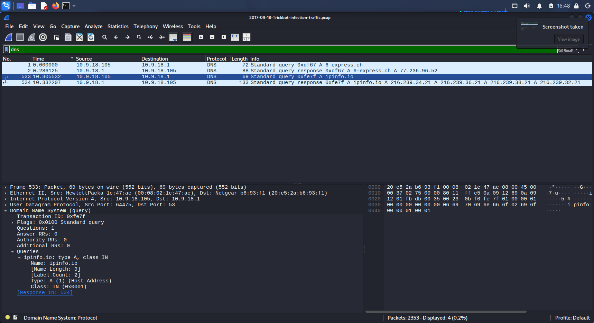
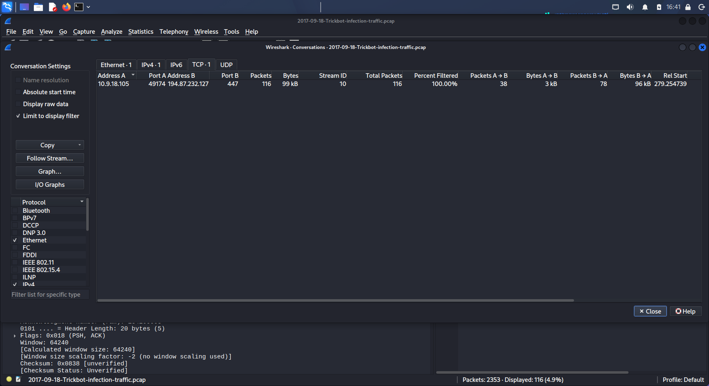
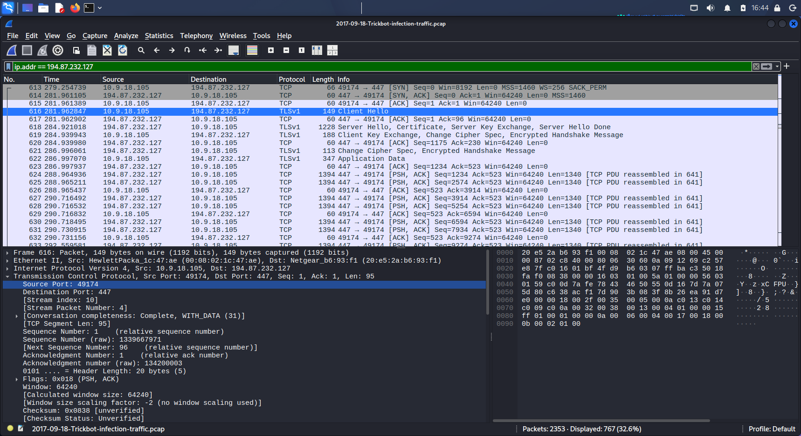

# TrickBot Infection — Full Traffic Analysis

**PCAP:** 2017-09-18-Trickbot-infection-traffic.pcap  
**Source:** malware-traffic-analysis.net  
**Tool:** Wireshark  
**Analyst:** Harilal P  

---

## Objective

Analyze a TrickBot malware infection PCAP to identify the infected host,
understand the infection behavior, extract network-based indicators of
compromise, and map observed activity to known TrickBot techniques — without
malware reverse engineering.

---

## Step 1 — Protocol Hierarchy



The first step was reviewing the overall traffic composition using
Statistics → Protocol Hierarchy.

**Observed breakdown:**
- TCP: 99.8% of all traffic
- Transport Layer Security (TLS): 11.5% — significant encrypted traffic
- HTTP: 0.1% — small amount of clear-text web traffic
- DNS: 0.2% — minimal domain resolution activity

The high proportion of TLS traffic was immediately notable. Most of the
communication in this capture is encrypted, meaning the malware relied
heavily on encrypted channels to hide its activity. The small amount of
HTTP traffic turned out to be the most critical — it contained both the
payload delivery and the reconnaissance request.

---

## Step 2 — Infected Host Identification



To identify the infected machine, Statistics → Endpoints → IPv4 was used.

**Results:**

| IP Address | Packets | Bytes | Role |
|------------|---------|-------|------|
| 10.9.18.105 | 2,353 | 2 MB | **Infected host** |
| 77.236.96.52 | 530 | 548 kB | Payload delivery server |
| 194.87.144.27 | 979 | 665 kB | C2 server (primary) |
| 194.87.232.127 | 767 | 752 kB | C2 server (secondary) |
| 94.242.224.226 | 24 | 2 kB | Unknown external |
| 185.158.115.47 | 24 | 2 kB | Unknown external |
| 216.239.34.21 | 25 | 6 kB | ipinfo.io (recon) |

`10.9.18.105` generated the most traffic by a significant margin —
2,353 packets and 2MB total — confirming it as the infected host.

**Important finding not in the original summary:**
`194.87.144.27` had 979 packets and 665kB — more than `194.87.232.127`
(767 packets, 752kB). This suggests `194.87.144.27` was the primary C2
server, not the secondary. Both IPs are indicators of compromise.

---

## Step 3 — Public IP Reconnaissance



Filter used: `http.request`

Two HTTP GET requests were visible:
1. `GET /kassa2g20.png` → `77.236.96.52` (payload download)
2. `GET /ip` → `216.239.34.21` (ipinfo.io recon)

The second request — `GET /ip HTTP/1.1` with `Host: ipinfo.io` — is
TrickBot performing public IP reconnaissance. Before establishing C2
contact, TrickBot queries an external IP lookup service to determine
the victim's external-facing IP address. This is used by operators to:

- Geolocate the victim
- Verify the infection reached the intended target
- Decide whether to continue or abort the infection based on geographic filters

The request used a real browser User-Agent string
(`Mozilla/5.0 Windows NT 10.0 WOW64 Chrome/57.0`) to blend in with
normal web traffic.

---

## Step 4 — Malicious Payload Disguised as PNG



This was the most significant finding in the analysis.

Filter used: `http.request`  
Packet selected: `GET /kassa2g20.png HTTP/1.1` from `10.9.18.105` to `77.236.96.52`

Following the TCP stream revealed the full server response:

```
GET /kassa2g20.png HTTP/1.1
Host: 6-express.ch

HTTP/1.1 200 OK
Content-Type: image/png
Content-Length: 528384

MZ............This program cannot be run in DOS mode.
```

The server responded with `Content-Type: image/png` — indicating an image
file. However, the response body begins with `MZ`, which is the magic byte
signature of a Windows PE (Portable Executable) file. The string
`This program cannot be run in DOS mode` further confirms this is a
Windows executable, not an image.

**This technique is called masquerading.** The malware operator hosted
a PE executable on a web server and served it with a fake `image/png`
content type and a `.png` filename. This is designed to:

- Bypass basic file extension filtering
- Evade web proxies that check content type instead of file magic bytes
- Appear as a harmless image download in network logs

The file size was 528,384 bytes (approximately 516KB) — consistent with
a TrickBot installer DLL or executable.

---

## Step 5 — DNS Analysis

### 6-express.ch Resolution



Filter used: `dns`

The first DNS query in the capture was from `10.9.18.105` to local DNS
server `10.9.18.1` for `6-express.ch`. The response resolved the domain
to `77.236.96.52`. This directly preceded the HTTP GET request for
`kassa2g20.png` — confirming the sequence:

```
DNS query: 6-express.ch → 77.236.96.52
HTTP GET: /kassa2g20.png from 77.236.96.52
```

### ipinfo.io Resolution



The second DNS query was for `ipinfo.io`, resolved to multiple IPs
including `216.239.34.21`. This directly preceded the `GET /ip` request,
confirming the full reconnaissance sequence:

```
DNS query: ipinfo.io → 216.239.34.21
HTTP GET: /ip to 216.239.34.21
```

Only two domains were queried in the entire capture. The absence of
additional domain activity suggests the C2 servers at `194.87.144.27`
and `194.87.232.127` were hardcoded IPs — the malware connected to them
directly without needing DNS resolution.

---

## Step 6 — TLS C2 Communication on Port 447



Filter used: `ip.addr == 194.87.232.127`

767 packets were exchanged between the infected host and this IP.
The conversation began with a TCP SYN to **port 447** — a non-standard
port with no legitimate service assignment.

The TLS handshake sequence was clearly visible:
1. `Client Hello` — infected host initiates TLS
2. `Server Hello, Certificate, Server Key Exchange, Server Hello Done`
3. `Client Key Exchange, Change Cipher Spec, Encrypted Handshake Message`
4. `Application Data` — encrypted C2 communication begins

### TCP Conversations View



The Conversations view (filtered to `ip.addr == 194.87.232.127`) showed
a single TCP conversation: `10.9.18.105:49174 → 194.87.232.127:447`
with 116 packets and 99kB transferred.

**Why port 447 is significant:**
Port 447 is not assigned to any standard service. Legitimate HTTPS uses
port 443. TrickBot deliberately uses 447 and 449 to avoid detection rules
tuned to standard port numbers. Any outbound TLS traffic to port 447 or
449 in an enterprise environment should be treated as a high-confidence
indicator of TrickBot infection.

The encrypted payload could not be inspected without the server's private
key. However, the combination of non-standard port, sustained TLS session,
and large data transfer to a known malicious IP provides strong evidence
of active C2 communication.

---

## Step 7 — No HTTP POST Observed

No HTTP POST requests were found when filtering `http.request.method == "POST"`.

This does not mean data exfiltration did not occur. TrickBot primarily
exfiltrates stolen credentials and system information through its encrypted
TLS C2 channel — not via plaintext HTTP POST. The 665kB transferred to
`194.87.144.27` and 752kB to `194.87.232.127` likely includes exfiltrated
data, but the contents cannot be confirmed without decryption.

This is an important limitation of network-only analysis: the absence of
visible exfiltration does not confirm its absence.

---

## Attack Flow Summary

```
Infected host: 10.9.18.105
         |
         ├─ DNS query: 6-express.ch → 77.236.96.52
         ├─ HTTP GET: /kassa2g20.png (PE executable disguised as PNG)
         ├─ Payload delivered: 528KB Windows executable
         |
         ├─ DNS query: ipinfo.io → 216.239.34.21
         ├─ HTTP GET: /ip (public IP reconnaissance)
         |
         ├─ Direct TCP connect: 194.87.144.27:447 (primary C2, 665kB)
         └─ Direct TCP connect: 194.87.232.127:447 (secondary C2, 752kB)
                  |
                  └─ TLS handshake + encrypted application data
                     (C2 communication and likely data exfiltration)
```

---

## IOC Summary

| Type | Value | Context |
|------|-------|---------|
| Infected host | `10.9.18.105` | Highest traffic internal host |
| Gateway/DNS | `10.9.18.1` | Local DNS resolver |
| Delivery domain | `6-express.ch` | Hosted malicious payload |
| Delivery IP | `77.236.96.52` | Resolved from 6-express.ch |
| Malicious file | `kassa2g20.png` | PE executable, 528KB |
| Recon domain | `ipinfo.io` | Public IP discovery |
| C2 IP (primary) | `194.87.144.27` | Port 447, TLS, 665kB |
| C2 IP (secondary) | `194.87.232.127` | Port 447, TLS, 752kB |
| C2 port | `447/TCP` | Non-standard TrickBot port |
| Unknown external | `94.242.224.226` | Low traffic, purpose unclear |
| Unknown external | `185.158.115.47` | Low traffic, purpose unclear |

---

## MITRE ATT&CK Mapping

| Technique | ID | Evidence |
|-----------|----|---------|
| Ingress Tool Transfer | T1105 | kassa2g20.png payload download |
| Masquerading | T1036.005 | PE disguised as PNG with fake content-type |
| Gather Victim Network Info | T1590 | ipinfo.io public IP check |
| Non-Standard Port | T1571 | C2 over TCP port 447 |
| Encrypted Channel | T1573 | TLS C2 traffic |
| Exfiltration Over C2 Channel | T1041 | Data transferred via TLS C2 |

---

## Analysis Limitations

- TLS traffic could not be decrypted — C2 commands and exfiltrated data are unknown
- No DHCP traffic present — Windows hostname not recovered from this PCAP
- Two external IPs (`94.242.224.226`, `185.158.115.47`) with low traffic
  remain unattributed — could be additional C2 or unrelated activity
- Capture window may not represent the full infection timeline
- No memory forensics performed — host-based indicators not available

---

## Tools Used

- Wireshark 4.x
- TCP stream analysis
- Statistics → Endpoints, Protocol Hierarchy, Conversations
- PCAP source: malware-traffic-analysis.net
